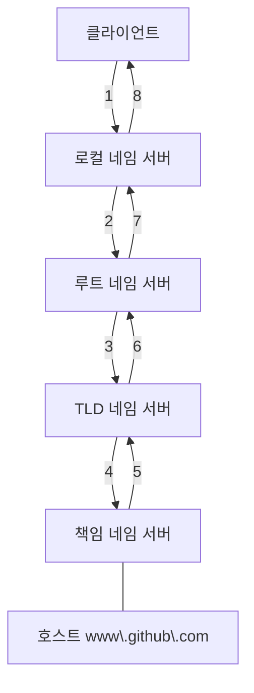
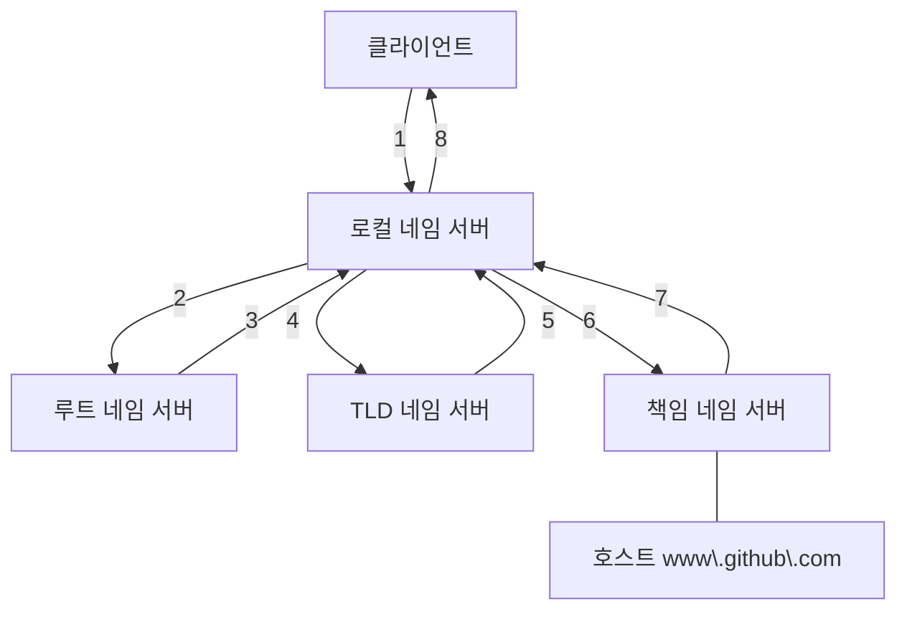

서버와 클라이언트는 '메시지를 주고 받고자 하는 대상'과 '송수신하고자 하는 정보'를 식별할 수 있어야 한다.  
이 때 메시지를 주고받고자 하는 대상을 파악하기 위해 IP 주소 이외에 도메인 네임을 사용할 수 있다.  
그리고 송수신하고자 하는 정보를 식별하기 위한 방법으로는 위치 가반 식별자인 URL과 이름 기반의 식별자인 URN이 있다.

## 도메인 네임과 네임 서버

IP 주소는 기억하고 있기도 어려울뿐더러, 호스트의 IP 주소는 언제든지 바뀔 수 있다.  
그래서 일반적으로 사용자는 상대 호스트를 특정하기 위해 IP 주소보다는 도메인 네임을 많이 사용한다.  
도메인 네임은 호스트의 IP 주소와 대응되는 문자열 형태의 호스트 특정 정보이다. (https://github.com)

이 도메인 네임과 IP 주소는 네임 서버에서 관리한다. 그래서 도메인 네임을 관리하는 네임 서버는 DNS 서버라고 부른다.

```
1. 사용자 -> https://github.com IP 주소를 알려줘 -> 네임 서버
2. 사용자 <- 1.2.3.4 <- 네임 서버
```

(nslookup 명령어를 사용하면 도메인 네임 아이피를 알 수 있다.)

IP 주소가 바뀌더라도 바뀐 IP 주소에 도메인 네임을 다시 대응하면 되므로 IP 주소만으로 호스트를 특정하는 것보다 더 간편하다.

---

도메인 네임은 점을 기준으로 계층적으로 분류된다.  
최상단에 루트 도메인이 있고, 그 다음 단계인 최상위 도메인이 있으며, 계속 그다음 단계의 도메인이 있는 식이다.

```
루트 도메인 (.)
     │
 ┌───┴──────────┐
(.com)        (.kr)    ← 최상위 도메인(TLD)
   │             │
example       example   ← 2단계 도메인
   │
  www  ← 3단계 도메인
```

도메인 네임의 마지막 부분을 최상위 도메인, 줄여서 TLD라고 한다.  
루트 도메인도 도메인 네임의 일부이다. 루트 도메인은 점으로 표현되며 도메인 네임의 마지막에 점이 찍힌 형태로 표기된다. (www.google.com. 로 접속해도 잘 접속된다.)  
최상위 도메인의 하부 도메인은 2단계 도메인이라고 한다.  
'www'는 3단계 도메인이다. 도메인의 단계는 이보다 더 늘어날 수도 있지만, 일반적으로 3~5단계 정도이다.

도메인 네임을 모두 포함하는 도메인 네임을 전체 주소 도메인 네임(FQDN, Fully-Qualified Domain Name)이라고 한다.  
FQDN의 첫 번째 부분까지 고려한 도메인 네임은 하나밖에 없다. 마지막 3단계 도메인까지 고려하면 호스트를 식별할 수 있는 도메인 네임을 얻을 수 있다.  
이런 점에서 FQDN의 첫 번째 부분(www)을 호스트 네임이라 부르기도 한다.

추가적으로 서브 도메인은 다른 도메인이 포함된 도메인을 의미한다.  
예를 들어 google.com의 서브 도메인은 (mail.google.com, www.google.com, scholar.google.com, drive.google.com 등이 있다.)

## 계층적 네임 서버

IP 주소를 모르는 상태에서 도메인 네임에 대응되는 IP 주소를 알아내는 과정을 흔히 도메인 네임을 풀이한다라고 표현하며, 영어로는 리졸빙한다라고도 표현한다.  
이 과정에서 다양한 네임 서버들이 사용되는데, 중요한 역할을 담당하는 네임 서버의 유형은 크게 네가지가 있다.  
'로컬 네임 서버(로컬 DNS 서버, 리졸버)', '루트 네임 서버(루트 DNS 서버)', 'TLD 네임 서버(TLD 서버)', 책임 네임 서버이다(책임 서버).

로컬 네임 서버는 클라이언트가 도메인 네임을 통해 IP 주소를 알아내고자 할 때 가장 먼저 찾게 되는 네임 서버이다.  
클라이언트가 로컬 네임 서버를 찾을 수 있으려면 로컬 네임 서버의 주소를 알고 있어야 한다.  
로컬 네임 서버의 주소는 일반적으로 ISP(Internet Service Provider, KT, SK 브로드밴드, LG U+)에서 할당해 주는 경우가 많다. 또는 공개 DNS 서버를 이용할 수도 있다. (구글의 8.8.8.8, 8.8.4.4와 클라우드플레어의 1.1.1.1)

로컬 네임 서버가 대응되는 IP 주소를 알고 있다면 클라인언트에게 그 IP 주소를 알려주면 된다.  
하지만 만약 로컬 네임 서버가 대응되는 IP 주소를 모른다면 루트 네임 서버에게 해당 도메인 네임을 질의하게 된다.  
루트 네임 서버는 루트 도메인을 관장하는 네임 서버로, 질의에 대해 TLD 네임 서버의 IP 주소를 반환할 수 있다.

```
<<로컬 네임 서버>> ----(www.github.com의 IP 주소가 뭐야)----> <<루트 네임 서버>>

<<로컬 네임 서버>> ----(com을 관리하는 TLD 네임 서버의 주소를 알려줄게 그곳에 물어봐)----> <<루트 네임 서버>>
```

TLD 네임 서버는 TLD를 관리하는 네임 서버이다. 그리고 TLD 네임 서버는 TLD의 하위 도메인 네임을 관리하는 네임 서버 주소를 반환할 수 있다.

```
<<로컬 네임 서버>> ----(www.github.com의 IP 주소가 뭐야)----> <<TLD 네임 서버>>

<<로컬 네임 서버>> ----(github.com을 관리하는 네임 서버의 주소를 알려줄게 그곳에 물어봐)----> <<TLD 네임 서버>>
```

책임 네임 서버는 특정 도메인 영역을 관리하는 네임 서버로, 자신이 관리하는 도메인 영역의 질의에 대해서는 다른 네임 서버에게 떠넘기지 않고 곧바로 답할 수 있는 네임 서버이다.  
즉, 책임 네임 서버는 로컬 네임 서버가 마지막으로 질의하는 네임 서버이다.  
일반적으로 로컬 네임 서버는 책임 네임 서버로부터 원하는 IP 주소를 얻어낸다.

---

로컬 네임 서버가 네임 서버들에게 질의하는 방법에는 크게 '재귀적 질의'와 '반복적 질의'라는 두 가지 방법이 있다.

재귀적 질의는 클라이언트가 로컬 네임 서버에게 도메인 네임을 질의하면, 로컬 네임 서버가 루트 네임 서버에게 지릉하고, 루트 네임 서버가 TLD 네임 서버에게 질의하고,  
TLD 네임 서버가 다음 단계에 질의하는 과정을 반복하며 최종 응답 결과를 역순으로 전달받는 방식이다.



반복적 질의란 클라이언트가 로컬 네임 서버에게 IP 주소를 알고 싶은 도메인 네임을 질의하면, 로컬 네임 서버는 루트 도메인 서버에게 질으해서 다음으로 질의할 네임 서버의 주소를 응답받고, 다음으로  
TLD 네임 서버에게 질의해서 다음으로 질의할 네임 서버의 주소를 응답받는 과정을 반복하다가 최종 응답 결과를 클라이언트에게 알려 주는 방식이다.



실제로는 네임 서버들이 기존에 응답받은 결과를 임시로 저장했다가 추후 같은 질의에 이를 활용하는 경우가 많다.  
이를 DNS 캐시라고 한다. DNS 캐시를 저장하는 용도로만 사용되는 서버도 있다.  
DNS 캐시는 영원히 남아있는 것은 아니다. 임시 저장된 값은 TTL(Time To Live)이라는 값과 함께 저장되는데, 이 값은 캐시될 수 있는 시간을 뜻한다.
